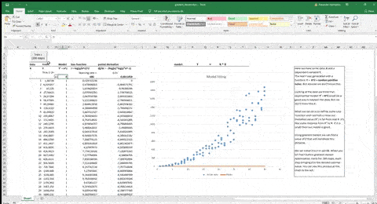

# Excel_gradient_decent
Gradient decent optimization in Excel. Sample.

There is a simple VBA macro that updates the parameter Z iteratively.

For this task, one could also use Excel iterative calculation (enable it in options, place formula in E6 "=E6-H6"). Thus there will be no need in macros at all. But it works too fast (like instantly) for this task to be presentational.

*J = MSLE
